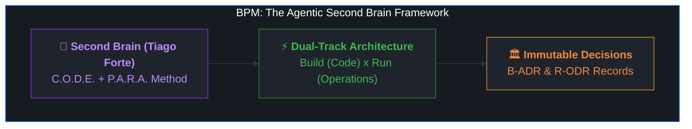

# Carlos Nogueira 👋
### AI Systems Architect & Founder of [@NROxAI](https://github.com/NROxAI)

[-8A2BE2?style=flat-square&logo=github)](https://github.com/NROxAI/Business-Project-Manager)

> *"Pioneering Autonomous AI Workflows, Agentic Knowledge Governance, and Scalable Digital Business Architectures."*

---

## 🌟 Featured Project: Business Project Manager (BPM)

I am the creator and lead architect of **[Business Project Manager (BPM)](https://github.com/NROxAI/Business-Project-Manager)** — a universal, platform-agnostic framework designed to bridge the critical gap between AI code generation and comprehensive real-world business governance.

* 🚀 **Universal AI Agnosticism:** Native support for Google Antigravity, Claude Code, Cursor, Codex, and ChatGPT.
* 🛡️ **The 7 Universal Pillars:** Brand protection (USPTO/INPI), edge infrastructure (Cloudflare), dedicated telephony & account isolation (anti-detect, proxies), traffic channels, AI hardening, automations (n8n), and dual-track governance.
* 📖 **Scientific Foundation:** Built upon the peer-reviewed methodologies of Tiago Forte (*Building a Second Brain*), Michael Nygard (*ADRs*), and Jeff Patton / Marty Cagan (*Dual-Track Engineering*).

👉 **[Explore the Repository & Star the Project ⭐](https://github.com/NROxAI/Business-Project-Manager)**

---

## 🛠️ Core Expertise & Engineering Focus

* **Autonomous AI Architecture:** Multi-agent orchestration, prompt defense (jailbreak & injection hardening), deterministic context handoffs, and LLM memory distillation.
* **Dual-Track Governance:** Strict isolation between software engineering pipelines (`Build`) and operational field execution (`Run`).
* **Edge & Cloud Infrastructure:** At-cost domain topology (Cloudflare Registrar), DNS security, automated email routing, and digital asset contingency.
* **Information Architecture:** Single Source of Truth (SSOT) design, zero-redundancy documentation, and cross-platform knowledge management.

---

## 📊 GitHub Analytics

  
  

---

## 🌐 Connect with Me

* 🏢 **Organization:** [@NROxAI](https://github.com/NROxAI)
* 💼 **Open to:** Strategic AI Partnerships, Open-Source Collaborations, and Advanced Agentic Architecture Consulting.

---

  Designed with precision by Carlos Nogueira • Building the future of AI and business symbiosis.

