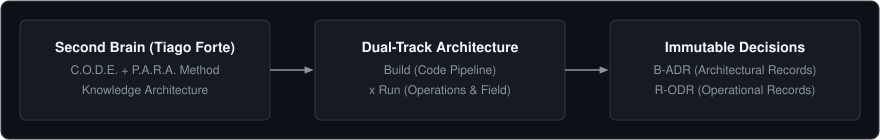

# Carlos Nogueira
### AI Systems Architect & Founder of [@NROxAI](https://github.com/NROxAI)

[-21262d?style=flat-square&logo=github&labelColor=161b22)](https://github.com/NROxAI/Business-Project-Manager)

> *"Pioneering Autonomous AI Workflows, Agentic Knowledge Governance, and Scalable Digital Business Architectures."*

---

## Featured Project: Business Project Manager (BPM)

I am the creator and lead architect of **[Business Project Manager (BPM)](https://github.com/NROxAI/Business-Project-Manager)** — a universal, platform-agnostic framework designed to bridge the critical gap between AI code generation and comprehensive real-world business governance.

  

* **Universal AI Agnosticism:** Native support for Google Antigravity, Claude Code, Cursor, Codex, and ChatGPT.
* **The 7 Universal Pillars:** Brand protection (USPTO/INPI), edge infrastructure (Cloudflare), dedicated telephony & account isolation (anti-detect, proxies), traffic channels, AI hardening, automations (n8n), and dual-track governance.
* **Scientific Foundation:** Built upon the peer-reviewed methodologies of Tiago Forte (*Building a Second Brain*), Michael Nygard (*ADRs*), and Jeff Patton / Marty Cagan (*Dual-Track Engineering*).

[Explore the Repository](https://github.com/NROxAI/Business-Project-Manager)

---

## Core Expertise & Engineering Focus

* **Autonomous AI Architecture:** Multi-agent orchestration, prompt defense (jailbreak & injection hardening), deterministic context handoffs, and LLM memory distillation.
* **Dual-Track Governance:** Strict isolation between software engineering pipelines (`Build`) and operational field execution (`Run`).
* **Edge & Cloud Infrastructure:** At-cost domain topology (Cloudflare Registrar), DNS security, automated email routing, and digital asset contingency.
* **Information Architecture:** Single Source of Truth (SSOT) design, zero-redundancy documentation, and cross-platform knowledge management.

---

## Technical Systems & Governance Matrix

| Domain | Architecture & Systems | Standard & Methodology | Operational Status |
| :--- | :--- | :--- | :--- |
| **Agentic Second Brain** | Business Project Manager (BPM) | Tiago Forte C.O.D.E. & P.A.R.A. | Under Active Review (Private) |
| **Engineering Motor** | Dual-Track Pipeline | Strict Isolation: Build (Code) x Run (Field) | Production Standard |
| **Decision Governance** | Architectural & Operational Records | Michael Nygard ADRs (`B-ADR`) & ODRs (`R-ODR`) | Immutable SSOT |
| **Cloud & Security Edge** | Cloudflare Topology & Account Contingency | ICANN At-Cost Registrar, WAF & Anti-Detect | Hardened |

---

## Contact & Inquiries

* **Organization:** [@NROxAI](https://github.com/NROxAI)
* **Focus:** Strategic AI Partnerships, Open-Source Governance, and Advanced Agentic Architectures.

---

  Designed with precision by Carlos Nogueira • Building the future of AI and business symbiosis.

